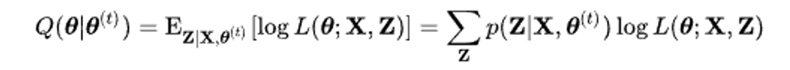

## Regression

### linear regression
$ y_i = \beta_0 + \beta_1 x_{i1} + \cdots + \beta_p x_{ip} + \epsilon+i, i = 1, \cdots , n $
  
$ y = X\beta + \epsilon $

### logistic regression
y가 상수가 아니라 라벨로 되어 있는 경우를 위해 개발됨
- odds
 
$ odds = {p(y=1|x) \over 1-p(y=1|x)} $
- logistic function
 
$ logistic function = {e^{\beta X_i} \over 1 + e^{\beta X_i}} $
- logit
 
$ logit(p) = log{p \over 1-p} $

## clustering

### K-NN
- k-NN 분류에서 출력은 소속된 항목이다. 객체는 k개의 최근접 이웃 사이에서 가장 공통적인 항목에 할당되는 객체로 과반수 의결에 의해 분류된다(k는 양의 정수이며 통상적으로 작은 수). 만약 k = 1 이라면 객체는 단순히 하나의 최근접 이웃의 항목에 할당된다.
- k-NN 회귀에서 출력은 객체의 특성 값이다. 이 값은 k개의 최근접 이웃이 가진 값의 평균이다.

### EM
- phase E
  
  
- phase M

  

## Dimension

### SVM
- 원형 SVM
   
   $ \argmin_{w, b} {1 \over 2} ||w||^2 $
#### Type of kernel function
1. linear model
  
  $ K(x^{(i)} , x^{(j)}) = {x^{(i)}}^T x^{(j)} $

2. polynomial model
  
  $ K(x^{(i)} , x^{(j)}) = ({x^{(i)}}^Tx^{(j)} + b)^P $

3. RBF kernel
  
  $ K(x^{(i)} , x^{(j)}) = exp(-{||x^{(i)} - x^{(j)}||^2_2 \over 2 \sigma^2}) $
  
### PCA
  
$ w_1 = \argmax_{||w||=1} E \{ (w^Tx)^2 \} $

### LDA
  
$ L(w) = {w^T \Sigma w \over w^T \Sigma_1 w + w^T \Sigma_2 w} $